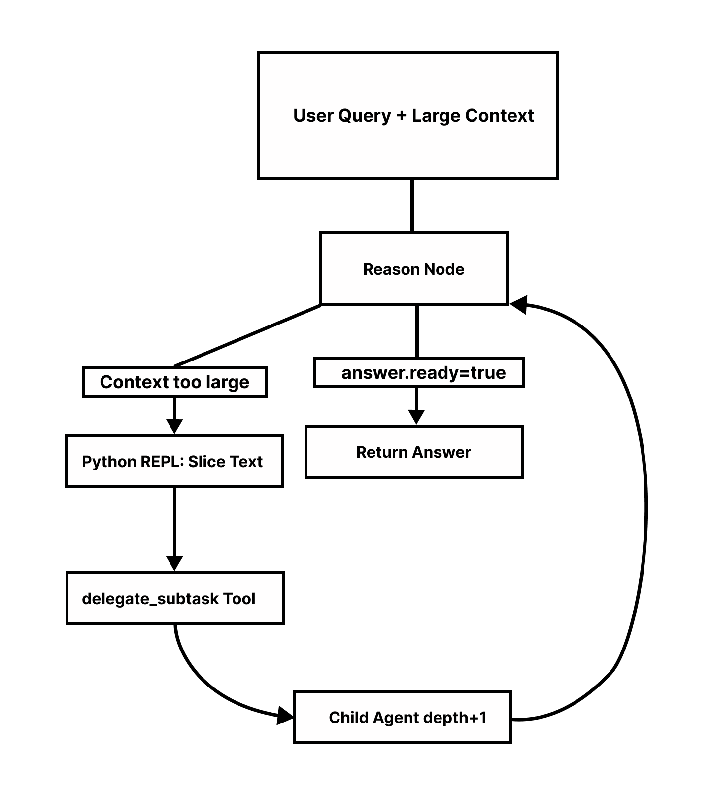

# Fractal-Context

> **Stop Context Rot.** A LangGraph implementation of Recursive Language Models with Chainlit UI for real time UI visualization with near infinite context through self-similar agent recursion.

An LLM agent that solves the "context rot" problem by **recursively spawning child agents** to process massive datasets. When the context is too large, the parent agent slices it and delegates chunks to sub-agents — each running as a nested LangGraph subgraph.

Built with a **Chainlit "Glass Box" UI** that visualizes recursion depth in real-time.

---

## Key Features

| Feature | Description |
|---------|-------------|
| 🔄 Recursive Agents | Parent agents spawn child agents to handle text chunks |
| 📊 Depth Tracking | Hard-capped recursion depth prevents runaway chains |
| 🔍 Python REPL | Agent can inspect and slice context strings on the fly |
| 🖥️ Glass Box UI | Chainlit visualization shows nested sub-agent execution |

---

## Tech Stack

- **Framework:** LangGraph, LangChain
- **UI:** Chainlit
- **Language:** Python 3.11+
- **LLM:** Llama3 70B via Groq API

---

## Quick Start

### 1. Clone & Install

```bash
git clone https://github.com/your-username/rlm-langgraph.git
cd rlm-langgraph
pip install -r requirements.txt
```

### 2. Configure API Key

```bash
cp .env.example .env
# Edit .env and add your GROQ_API_KEY
```

### 3. Run the UI

```bash
chainlit run ui/app.py
```

---

## Project Structure

```
rlm-langgraph/
├── src/
│   ├── __init__.py       # Package init
│   ├── state.py          # RLMState TypedDict (graph memory)
│   ├── tools.py          # REPL + recursive delegation tools
│   ├── graph.py          # Main StateGraph definition
│   └── utils.py          # File loading & text splitting
├── ui/
│   └── app.py            # Chainlit entry point
├── tests/                # Unit tests
├── README.md
├── requirements.txt
└── .env                  # API keys (not committed)
```

---

## How It Works



1. User sends a query with a large document.
2. The **Reason Node** evaluates if the context fits the LLM window.
3. If too large, the agent uses **Python REPL** to slice the text.
4. It calls **delegate_subtask** to spawn a child agent at `depth + 1`.
5. The child agent processes its chunk and returns a partial answer.
6. Answers bubble up until `answer["ready"] == True`.

---
